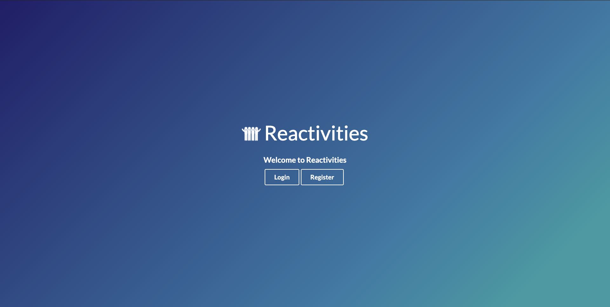
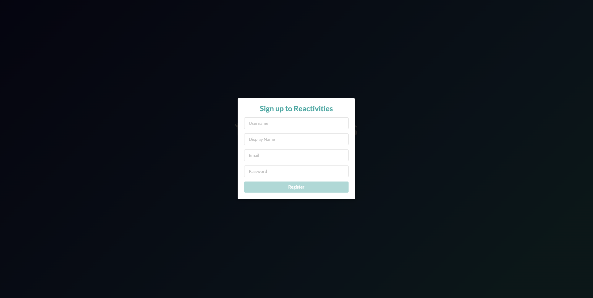
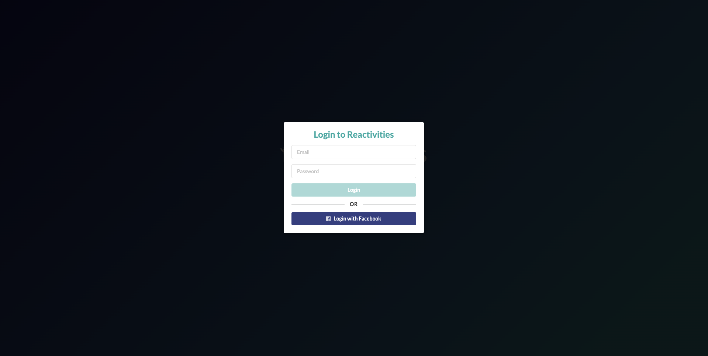
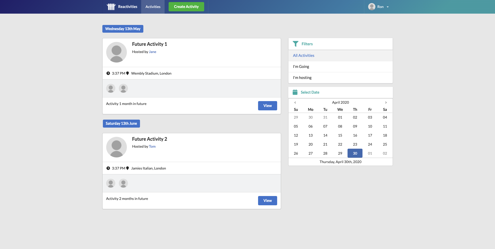
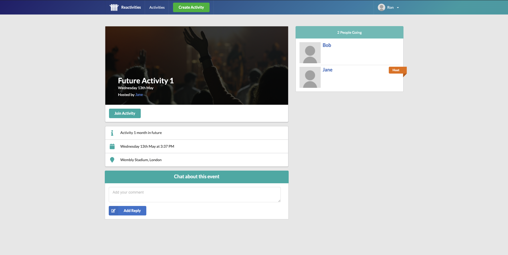
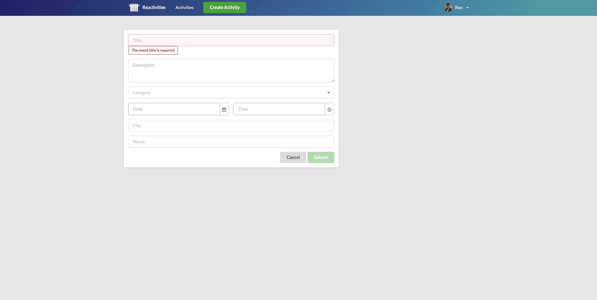
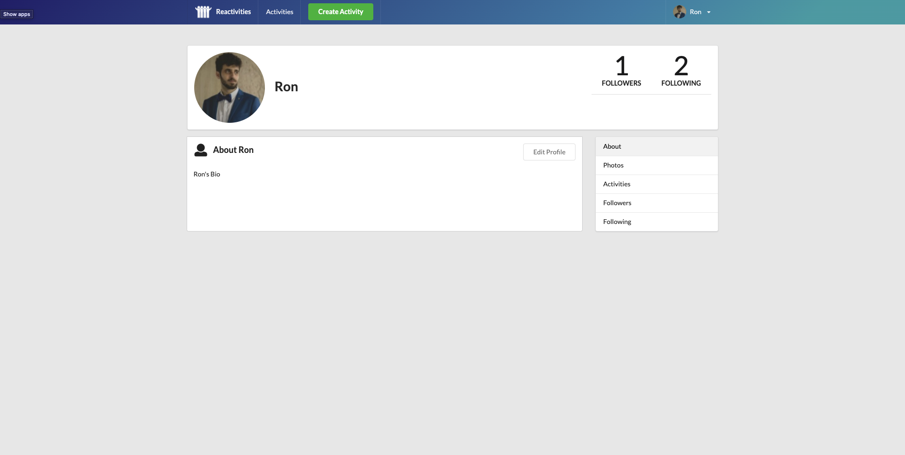
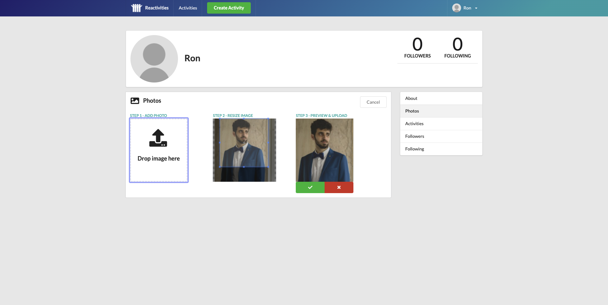

# Reactivities

Reactivities is a real time social network built with React and ASP.NET(C#).

it contains a user authentication system, activity management including real time chat, user profile management including following/followers, photo cropper and upload.

## Table Of Contents
- [Reactivities](#reactivities)
  - [Table Of Contents](#table-of-contents)
  - [Screenshots](#screenshots)
    - [Landing Page](#landing-page)
    - [Signup/Login](#signuplogin)
    - [Activities Feed](#activities-feed)
    - [Activity Details](#activity-details)
    - [Activity Form](#activity-form)
    - [Profile](#profile)
    - [Upload Image,](#upload-image)
  - [Tech-stack](#tech-stack)
        - [This project is built as part of Neil Cummings C#-ASP.NET Course on Udemy.](#this-project-is-built-as-part-of-neil-cummings-c-aspnet-course-on-udemy)

## Screenshots

### Landing Page
Not authenticated users will see a login and sign up buttons, authenticated will only see a "Go to Activities" button.

### Signup/Login

### Activities Feed
Authenticated users can click an activity to view its details, filter by activities they are going to or activities they host.
they also can view activities from a certain date.

### Activity Details
Authenticated user can view the activity information including RSVPs, host, location and date.
When the user is host, he also can click on edit to change the activity info.

### Activity Form
Authenticated user can access this form when clicking on the navigation bar button "Add activity" to create a new activity,
or when trying to edit an activity, in this case the activity information will be filled automatically.
when wrong input is typed, there will be a flashing message to warn the user about it. 

### Profile
A user can manage his profile or view other users profile, on his own profile he is able to edit his bio, upload photos, choose a profile photo, view his hosted activities and activities he's going to, and also view his followers or following.

### Upload Image,
While adding a photo to the current authenticated user, he can drag and drop or choose an image, crop it and get a real time preview of the result. 

## Tech-stack
1. React, MobX, Axios, Semantic-UI, TypeScript, Final-Form, Revalidate, React-Toastify.
2. C# (ASP.NET), SignalR, SQL-Server(Entity Framework), Cloudinary.

##### This project is built as part of Neil Cummings C#-ASP.NET Course on Udemy.